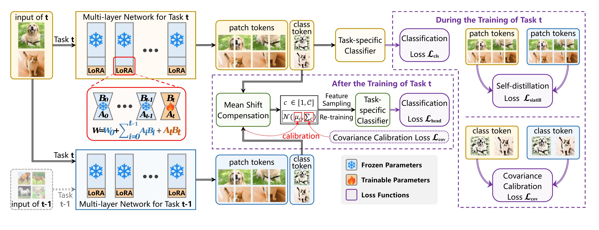

# [Navigating Semantic Drift in Task-Agnostic Class-Incremental Learning](https://arxiv.org/abs/2502.07560)

## Abstract

<div align="justify">
Class-incremental learning (CIL) seeks to enable
a model to sequentially learn new classes while
retaining knowledge of previously learned ones.
Balancing flexibility and stability remains a significant challenge, particularly when the task ID is unknown. To address this, our study reveals
that the gap in feature distribution between novel
and existing tasks is primarily driven by differences in mean and covariance moments. Building on this insight, we propose a novel semantic drift calibration method that incorporates mean shift compensation and covariance calibration. Specifically, we calculate each class’s mean by averaging its sample embeddings and estimate task shifts using weighted embedding changes based on their proximity to the previous mean, effectively capturing mean shifts for all learned classes with each new task. We also apply Mahalanobis distance constraint for covariance calibration, aligning class-specific embedding covariances between old and current networks to mitigate the covariance shift. Additionally, we integrate a feature-level self-distillation approach to enhance generalization. Comprehensive experiments on commonly used datasets demonstrate the effectiveness of our approach.
</div>

 The overall framework of our proposed method *Mahalanobis Anchored Class-Incremental Learning* (MACIL).

## Dataset preparation
* Create a folder for datasets in your workspace directory `./datasets/`
* **CIFAR 100**: Should be automatically downloaded
* **ImageNet-R**, **ImageNet-A**, **CUB-200**: Download the pre-processed datasets from [PILOT: A Pre-Trained Model-Based Continual Learning Toolbox](https://github.com/sun-hailong/LAMDA-PILOT)

## Enviornment
This code is implemented in PyTorch, runs on a single A40 GPU, and the experiments are conducted under the following environment settings:
- python = 3.9
- torch = 2.0.1
- torchvision = 0.15.2
- timm = 0.6.12

### Clone this repo in your directory
```
git clone https://github.com/fwu11/MACIL.git
cd MACIL
```
## Train
### ImageNet-R (10 Tasks):
```
python main.py --device "0" --config ./exps/imgr10.json 
```
### CIFAR100  (10 Tasks):
```
python main.py --device "0" --config ./exps/cifar10.json 
```
### CIFAR100  (5 Tasks):
```
python main.py --device "0" --config ./exps/cifar5.json 
```
### ImageNet-A (10 Tasks):
```
python main.py --device "0" --config ./exps/imga10.json 
```
### CUB-200 (10 Tasks):
```
python main.py --device "0" --config ./exps/cub10.json 
```

## Contact
If you have any questions about our work or this repository, please contact us by email.
* fwu11@zhejianglab.org

## Citation
```
@misc{wu2025navigatingsemanticdrifttaskagnostic,
      title={Navigating Semantic Drift in Task-Agnostic Class-Incremental Learning}, 
      author={Fangwen Wu and Lechao Cheng and Shengeng Tang and Xiaofeng Zhu and Chaowei Fang and Dingwen Zhang and Meng Wang},
      year={2025},
      eprint={2502.07560},
      archivePrefix={arXiv},
      primaryClass={cs.CV},
      url={https://arxiv.org/abs/2502.07560}, 
}
```


## Acknoledgements
Our work is built on the following repo, we appreciate their great work
- [PILOT: A Pre-Trained Model-Based Continual Learning Toolbox](https://github.com/sun-hailong/LAMDA-PILOT)


